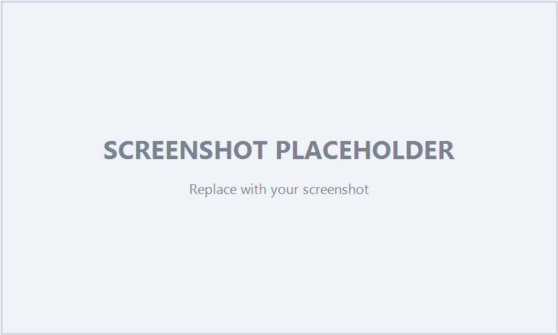
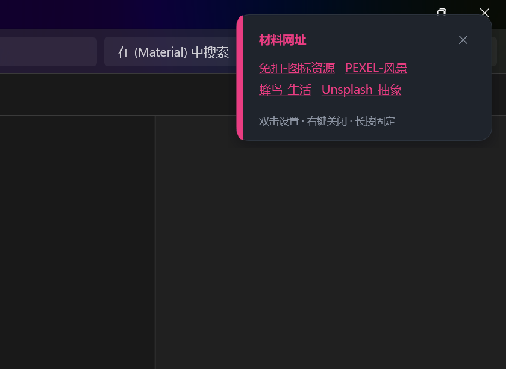

# TextBanner

Text-triggered floating banner for Windows · 文本触发的 Windows 悬浮提示条。

> Watches for keywords in window titles / browser tab titles / text file contents / opened folder paths, and pops a banner. It does **not** read web page content.
> 监视窗口标题 / 浏览器标签标题 / 文本文件内容 / 已打开文件夹路径中的关键词，弹出悬浮提示。它**不会**读取网页正文。

## Install · 安装

**Download** the latest from [Releases](../../releases) · 从 [Releases](../../releases) 下载最新版：

| File · 文件 | What · 说明 |
|---|---|
| `TextBanner-Setup.exe` | Installer (per-user, no admin) · 安装器（免管理员） |
| `release-win-x64.zip` | Portable, unzip & run `TextBanner.exe` · 便携版，解压即用 |

**Build from source · 源码构建：**

```powershell
.\publish.ps1 -SelfContained   # self-contained bundle into publish\
.\install.ps1                  # or install via PowerShell (Start Menu + Desktop shortcuts)
```

## Set language · 设置语言

Settings → **General** → **Appearance** → **Language** → 中文 / English

设置 → **常规设置** → **外观** → **语言** → 中文 / English

## Browser tab detection · 浏览器标签检测

For the *browser tab* source (fires on **newly opened** tabs), load `browser-extension/` as an unpacked extension (Chrome `chrome://extensions` / Edge `edge://extensions` → Developer mode), or launch the browser with `--remote-debugging-port`.

「浏览器标签」来源只在**新打开标签页**时触发：把 `browser-extension/` 作为解压扩展加载，或给浏览器加 `--remote-debugging-port` 启动参数。

## Features · 功能

- 4 sources: browser tab / folder / window title / text file（4 种来源）
- Banner: double-click = settings · right-click/✕ = close · long-press = pin（双击设置 · 右键/✕ 关闭 · 长按固定）
- Markdown display text（Markdown 显示文本）· Themes + follow system（5 套主题 + 跟随系统）· Per-rule color & open-on-trigger action（每规则颜色 + 触发后打开）

## Screenshots

| Settings 设置 | Banner 提示条 | Themes 主题 |
|---|---|---|
|  |  |  |

## License

[MIT](LICENSE)

---

Built with the help of an AI coding agent (DeepSeek Harness). · 本项目由 AI 编程助手（DeepSeek Harness）协助开发。
